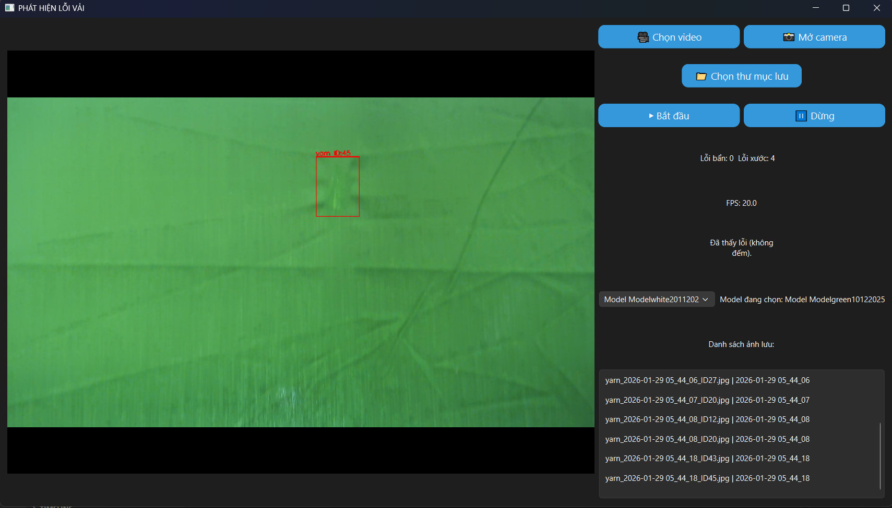

## Model File

Due to GitHub file size limits, the trained YOLO model is not included.

Please download the model from:
[https://drive.google.com/drive/folders/1KQzKqbMz65ROShZwqtHyjwVdYM8ojRqM?usp=drive_link]

## Demo Video



Click the image below to watch the demo video (30 seconds):

[](demo/videotest.mp4)

# Fabric Defect Detection System using YOLO and PySide6

##  Overview

This project is an AI-based Fabric Defect Detection System developed using **YOLO (Ultralytics)** for object detection and **PySide6 (Qt for Python)** for building a desktop graphical user interface.

The system allows users to load fabric images or use camera input to automatically detect and visualize fabric defects using a trained YOLO model.

This project is designed for applications in textile quality control and automated inspection systems.

---

##  Features

- Load and run YOLO model (.pt)
- Detect fabric defects from images
- Real-time detection (if camera enabled)
- Display bounding boxes and confidence scores
- User-friendly desktop GUI
- Multi-threaded processing for smooth UI performance

---

##  Technologies Used

###  Artificial Intelligence
- YOLO (Ultralytics)
- PyTorch
- Computer Vision

###  GUI Framework
- PySide6 (Qt for Python)

###  Image Processing
- OpenCV
- Pillow (PIL)

###  Core Python Libraries
```python
import sys
import cv2
import os
import time
import threading
from PIL import Image
from PySide6.QtWidgets import *
from PySide6.QtGui import *
from PySide6.QtCore import *
from ultralytics import YOLO
import torch


