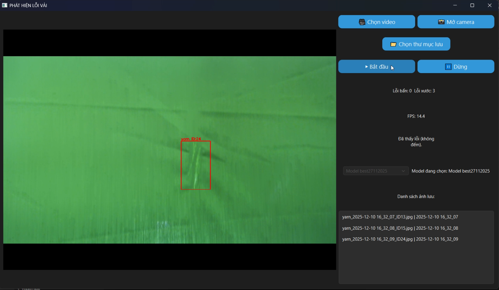

# Fabric Defect Detection System using YOLO and PySide6

## Overview

This project is an AI-based Fabric Defect Detection System developed using **YOLO (Ultralytics)** for object detection and **PySide6 (Qt for Python)** for building a desktop graphical user interface.

The YOLO model was trained using data prepared and managed on **Roboflow**:  
[Roboflow](https://roboflow.com/)

The system allows users to load fabric images or use camera input to automatically detect and visualize fabric defects using a trained YOLO model.

This project is designed for applications in textile quality control and automated inspection systems.

---

## Model File

Due to GitHub file size limits, the trained YOLO model is not included in this repository.

Please download the trained model from Google Drive:

[Download YOLO Model](https://drive.google.com/drive/folders/1KQzKqbMz65ROShZwqtHyjwVdYM8ojRqM?usp=drive_link)

---

## Demo Video

Click the thumbnail below to watch the demo video:

[](https://drive.google.com/file/d/138Z28BjqPZxfTUSFltlhvG-kCyVeisNS/view?usp=drive_link)

---

## Demo Images

### Demo Image 1

[View Demo Image 1](https://drive.google.com/file/d/12ZU6TDz3WOn02It5FFSOhTxHS14AOTiZ/view?usp=drive_link)

### Demo Image 2

[View Demo Image 2](https://drive.google.com/file/d/1AtO0jh5KtUCrlxNhB4kC4-IQbeGG8nOB/view?usp=drive_link)

### Demo Image 3

[View Demo Image 3](https://drive.google.com/file/d/1VjtPW_tiTHaEzKbwsiFJ70-WNqsgRYX6/view?usp=drive_link)

---

## Features

- Load and run YOLO model `.pt`
- Detect fabric defects from images
- Real-time detection if camera mode is enabled
- Display bounding boxes and confidence scores
- User-friendly desktop GUI
- Multi-threaded processing for smooth UI performance

---

## Technologies Used

### Artificial Intelligence

- YOLO Ultralytics
- PyTorch
- Roboflow
- Computer Vision

### GUI Framework

- PySide6 Qt for Python

### Image Processing

- OpenCV
- Pillow PIL

### Core Python Libraries

```python
import sys
import cv2
import os
import time
import threading
from PIL import Image
from PySide6.QtWidgets import *
from PySide6.QtGui import *
from PySide6.QtCore import *
from ultralytics import YOLO
import torch
